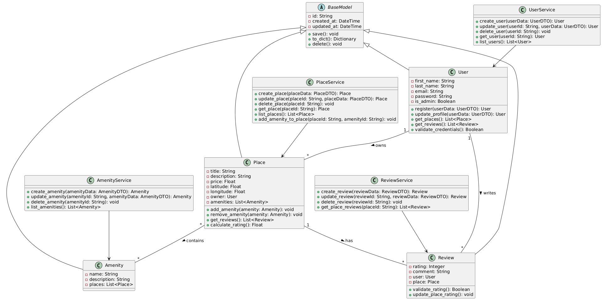
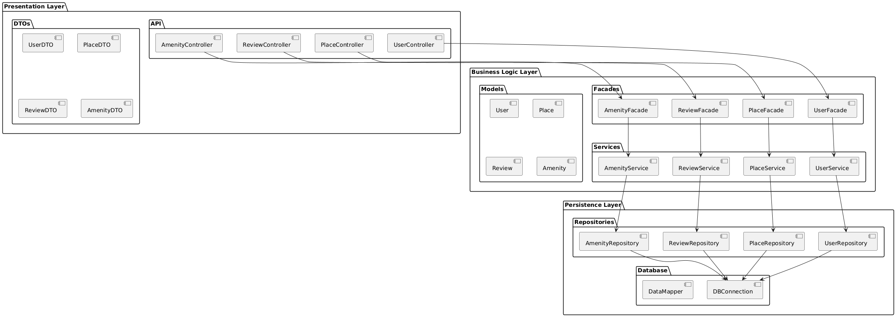

# HBnB Evolution Technical Documentation

## Table of Contents
1. [Overview](#overview)
2. [UML Diagrams](#uml-diagrams)
3. [System Architecture](#system-architecture)
4. [Domain Models](#domain-models)
5. [Business Rules](#business-rules)
6. [Data Layer](#data-layer)

## Overview

HBnB Evolution is a property rental platform inspired by AirBnB. The system allows users to list properties, manage bookings, and leave reviews.

### Core Features
- User registration and profile management
- Property listing and management
- Review and rating system
- Amenity management

## UML Diagrams

### Class Diagram
The following class diagram illustrates the relationships between the main entities in our system:



This diagram shows the inheritance hierarchy and relationships between BaseModel, User, Place, Review, and Amenity classes, along with their attributes and methods.

### Package Diagram
The package diagram demonstrates the high-level organization of our system components:



This diagram illustrates how different modules are organized and their dependencies.

### Sequence Diagrams

#### User Registration Flow
The following diagram shows the sequence of interactions during user registration:


This diagram illustrates the steps involved when a new user registers on the platform.

#### Place Creation Process
The sequence for creating a new property listing:


This diagram shows the interaction between different components when a user creates a new place listing.

#### Fetching Places List
The sequence for retrieving the list of available places:


This diagram demonstrates how the system handles requests for viewing available properties.

#### Review Submission Process
The sequence for submitting a review:


This diagram shows the flow of interactions when a user submits a review for a place.

## System Architecture

The application follows a three-tier architecture:

### 1. Presentation Layer
- Handles client interactions
- Implements REST APIs
- Manages authentication/authorization
- Validates input data

### 2. Business Logic Layer
- Implements core business rules
- Manages domain models
- Handles data validation
- Coordinates operations

### 3. Persistence Layer
- Manages data storage
- Implements CRUD operations
- Ensures data integrity

## Domain Models

### BaseModel
Common attributes for all entities:
```python
class BaseModel:
    id: str          # Unique identifier
    created_at: datetime  # Creation timestamp
    updated_at: datetime  # Last update timestamp
```

### User
```python
class User(BaseModel):
    first_name: str
    last_name: str
    email: str      # Unique
    password: str   # Hashed
    is_admin: bool  # Administrator flag
```

### Place
```python
class Place(BaseModel):
    title: str
    description: str
    price: float
    latitude: float
    longitude: float
    owner_id: str           # Reference to User
    amenities: List[str]    # List of amenity IDs
```

### Review
```python
class Review(BaseModel):
    rating: int        # 1-5 rating
    comment: str
    user_id: str      # Reference to User
    place_id: str     # Reference to Place
```

### Amenity
```python
class Amenity(BaseModel):
    name: str
    description: str
```

## Business Rules

### User Management

#### Registration
- Email must be unique
- Password must be securely hashed
- Required fields: first_name, last_name, email, password

#### Authentication
- Email/password validation
- JWT token generation
- Session management

#### Authorization
- Role-based access control (admin/regular user)
- Resource ownership validation

### Place Management

#### Creation
- Only authenticated users can create places
- Required fields: title, price, location
- Owner automatically assigned

#### Updates
- Only owner can modify place details
- Admin can moderate content

#### Deletion
- Only owner or admin can delete places
- Associated reviews must be handled

### Review Management

#### Creation
- Only authenticated users can create reviews
- One review per user per place
- Rating must be between 1-5

#### Validation
- Comment cannot be empty
- User cannot review own property

### Amenity Management

#### Operations
- Only admin can create/update/delete amenities
- All users can view amenities

#### Association
- Places can have multiple amenities
- Amenities can be associated with multiple places

## Data Layer

### Database Schema
```sql
-- Users table
CREATE TABLE users (
    id VARCHAR PRIMARY KEY,
    first_name VARCHAR NOT NULL,
    last_name VARCHAR NOT NULL,
    email VARCHAR UNIQUE NOT NULL,
    password_hash VARCHAR NOT NULL,
    is_admin BOOLEAN DEFAULT FALSE,
    created_at TIMESTAMP,
    updated_at TIMESTAMP
);

-- Places table
CREATE TABLE places (
    id VARCHAR PRIMARY KEY,
    title VARCHAR NOT NULL,
    description TEXT,
    price DECIMAL(10,2) NOT NULL,
    latitude DECIMAL(10,8),
    longitude DECIMAL(11,8),
    owner_id VARCHAR REFERENCES users(id),
    created_at TIMESTAMP,
    updated_at TIMESTAMP
);

-- Reviews table
CREATE TABLE reviews (
    id VARCHAR PRIMARY KEY,
    rating INTEGER CHECK (rating BETWEEN 1 AND 5),
    comment TEXT NOT NULL,
    user_id VARCHAR REFERENCES users(id),
    place_id VARCHAR REFERENCES places(id),
    created_at TIMESTAMP,
    updated_at TIMESTAMP,
    UNIQUE(user_id, place_id)
);

-- Amenities table
CREATE TABLE amenities (
    id VARCHAR PRIMARY KEY,
    name VARCHAR NOT NULL,
    description TEXT,
    created_at TIMESTAMP,
    updated_at TIMESTAMP
);

-- Place-Amenity relationship table
CREATE TABLE place_amenities (
    place_id VARCHAR REFERENCES places(id),
    amenity_id VARCHAR REFERENCES amenities(id),
    PRIMARY KEY (place_id, amenity_id)
);
```

### Data Access Patterns

#### User Operations
```python
def create_user(user_data: dict) -> User
def get_user_by_id(user_id: str) -> User
def get_user_by_email(email: str) -> User
def update_user(user_id: str, data: dict) -> User
def delete_user(user_id: str) -> bool
```

#### Place Operations
```python
def create_place(place_data: dict) -> Place
def get_place_by_id(place_id: str) -> Place
def get_places_by_owner(owner_id: str) -> List[Place]
def update_place(place_id: str, data: dict) -> Place
def delete_place(place_id: str) -> bool
```

#### Review Operations
```python
def create_review(review_data: dict) -> Review
def get_place_reviews(place_id: str) -> List[Review]
def update_review(review_id: str, data: dict) -> Review
def delete_review(review_id: str) -> bool
```

#### Amenity Operations
```python
def create_amenity(amenity_data: dict) -> Amenity
def get_all_amenities() -> List[Amenity]
def update_amenity(amenity_id: str, data: dict) -> Amenity
def delete_amenity(amenity_id: str) -> bool
```

### Data Validation

#### Input Validation
- Type checking
- Format validation
- Required fields verification

#### Business Rule Validation
- Ownership verification
- Permission checking
- Relationship validation

#### Data Integrity
- Foreign key constraints
- Unique constraints
- Data consistency checks
